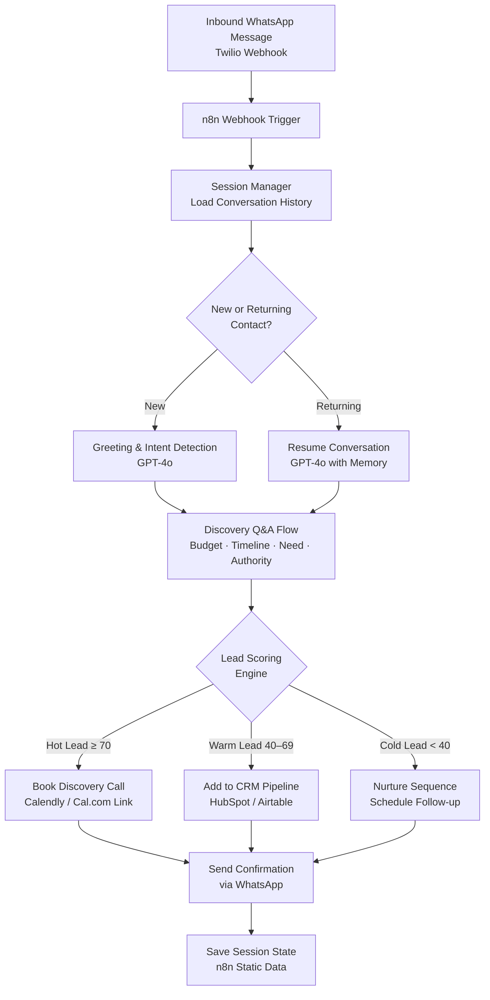
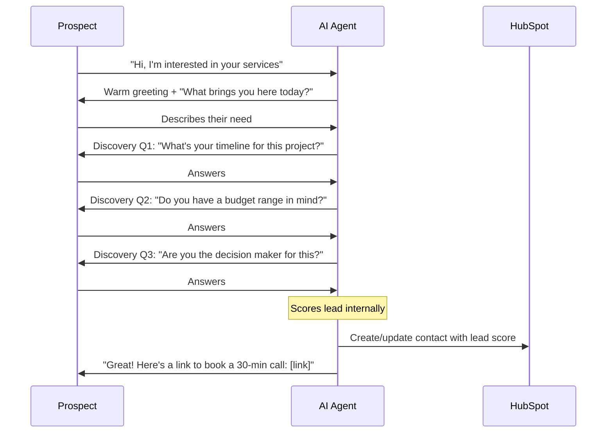

# WhatsApp Lead Agent


> **Turn inbound WhatsApp messages into qualified leads — automatically, conversationally, at any hour.**

---

## Overview

This n8n workflow transforms a Twilio WhatsApp number into an always-on AI lead qualification agent. When a prospect messages your business on WhatsApp, the agent engages them in a natural conversation, asks targeted discovery questions, scores the lead based on their responses, and either books a discovery call or routes them into your CRM pipeline — without any human involvement.

The agent maintains conversation context across multiple messages, handles ambiguous answers gracefully, and hands off to a human rep only when genuinely needed.

---

## Use Case

**Who uses this?**
Service businesses (agencies, consultants, coaches, real estate firms) that receive inbound WhatsApp inquiries and want to qualify prospects without tying up a sales rep's time.

**Problem it solves:**
Most businesses either ignore WhatsApp leads (slow response = lost sale) or pay someone to manually qualify every inquiry. Neither scales. A prospect who messages at 11pm gets no reply until morning — by which point they've moved on.

**Result:**
Every inbound WhatsApp message gets an instant, intelligent response. The agent qualifies the lead in 3–5 messages, scores them, and either books a call automatically or adds them to a CRM pipeline — all while the business owner sleeps.

---

## Architecture



---

## Tech Stack

| Tool | Role |
|------|------|
| **n8n** | Workflow orchestration and session state management |
| **Twilio WhatsApp API** | Inbound/outbound WhatsApp messaging |
| **OpenAI GPT-4o** | Conversational AI, intent detection, lead scoring |
| **HubSpot** | CRM — contact creation and pipeline management |
| **Calendly / Cal.com** | Booking link generation for hot leads |
| **n8n Static Data** | Lightweight conversation session persistence |

---

## Conversation Flow



---

## Setup Instructions

> **Prerequisites:** n8n instance, Twilio account with WhatsApp sandbox or approved number, OpenAI API key.

1. **Clone this repository**
   ```bash
   git clone https://github.com/evance262/automation-portfolio.git
   cd automation-portfolio/projects/02-whatsapp-lead-agent
   ```

2. **Set up Twilio WhatsApp**
   - Log in to [Twilio Console](https://console.twilio.com)
   - Go to **Messaging → Try it out → Send a WhatsApp message** (sandbox) or apply for a dedicated number
   - Set the **"When a message comes in"** webhook URL to your n8n webhook endpoint

3. **Copy environment variables**
   ```bash
   cp .env.example .env
   # Fill in all placeholder values
   ```

4. **Import the workflow into n8n**
   - Open n8n → Workflows → Import from file → upload `workflow.json`
   - Connect Twilio, OpenAI, and HubSpot credentials in the credential manager

5. **Configure your qualification questions**
   - In the n8n workflow, open the **Discovery Q&A** node
   - Edit the system prompt to match your business's qualification criteria

6. **Test**
   - Send "Hi" to your Twilio WhatsApp number from a personal WhatsApp account
   - Watch the conversation progress through the n8n execution log

---

## Environment Variables

| Variable | Description |
|----------|-------------|
| `TWILIO_ACCOUNT_SID` | Twilio Account SID (starts with `AC`) |
| `TWILIO_AUTH_TOKEN` | Twilio Auth Token |
| `TWILIO_WHATSAPP_NUMBER` | Your Twilio WhatsApp number (e.g. `whatsapp:+14155238886`) |
| `N8N_WEBHOOK_URL` | n8n webhook URL for inbound messages |
| `OPENAI_API_KEY` | OpenAI API key (GPT-4o access required) |
| `HUBSPOT_API_KEY` | HubSpot private app token |
| `BOOKING_LINK` | Your Calendly or Cal.com scheduling link |

See [.env.example](.env.example) for placeholder values.

---

## Key Design Decisions

**Why Twilio over WhatsApp Cloud API directly?**
Twilio abstracts away WhatsApp's message template approval process and provides a reliable sandbox for development. For production at scale, the architecture is identical — only the credential layer changes.

**How is conversation state managed?**
n8n's Static Data stores the conversation history keyed by the sender's phone number. This is intentionally lightweight — for high-volume production use, swap this for a Redis or Postgres store via the n8n database node.

**How does lead scoring work?**
The GPT-4o model evaluates the full conversation and returns a JSON object with a `score` (0–100), `tier` (hot/warm/cold), and `summary`. This structured output drives the routing logic deterministically — no fuzzy string matching.

**What happens if the AI is unsure?**
An uncertainty detection layer in the system prompt instructs the model to ask for clarification rather than guess. After two failed clarification attempts, the workflow routes to human handoff.

---

## License

MIT — see [LICENSE](../../LICENSE) for details.

---

*Built by [Evance Chapuma](https://www.upwork.com/freelancers/evancechapuma) — AI Automation Specialist*
