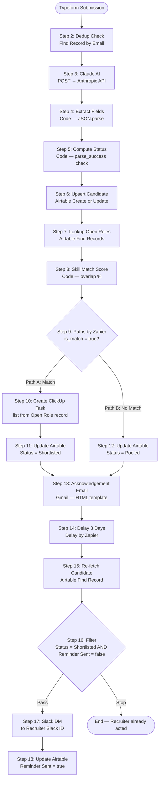
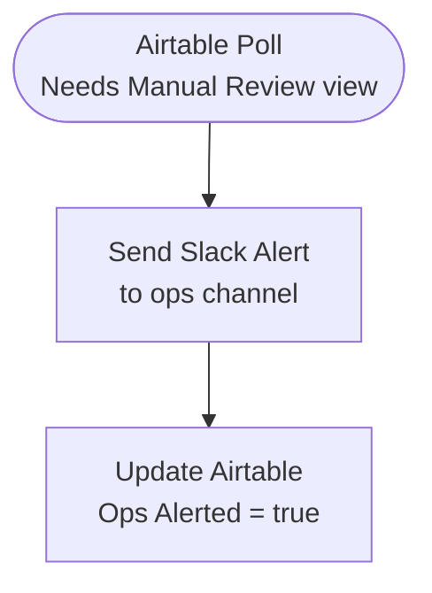
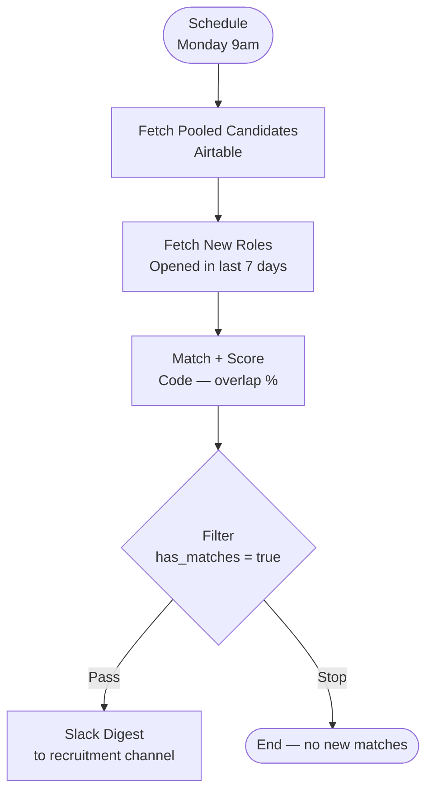

# Candidate Pipeline Automation — Zapier


> **End-to-end Zapier recruitment pipeline — a candidate submits their CV via Typeform, Claude AI parses the CV and scores skill overlap, the candidate is routed to Shortlisted or Talent Pool in Airtable, a ClickUp review task is created for the recruiter, an acknowledgement email fires automatically, and three days later a Slack reminder goes out if no action has been taken — zero human touch until a recruiter needs to act.**

---

## Overview

This system automates the full intake-to-review cycle of a recruitment pipeline across three Zaps:

| Zap | Trigger | What it does |
|-----|---------|--------------|
| **Zap 1 — Main Pipeline** | Typeform CV submission | Parses CV with Claude AI, deduplicates by email, creates Airtable record, matches skills against open roles, routes to Shortlisted or Pooled, creates ClickUp task, sends acknowledgement email, delays 3 days, sends Slack recruiter reminder if unreviewed |
| **Zap 2 — Parse Error Handler** | Airtable view poll (every ~15 min) | Detects records where AI parsing failed, sends Slack ops alert, marks record to prevent duplicate alerts |
| **Zap 3 — Weekly Pooled Digest** | Schedule (Mondays, 9am) | Matches Pooled candidates against newly opened roles from the past 7 days, sends a digest to the recruitment Slack channel |

Together they cover every state a candidate submission can reach — clean parse, failed parse, match, no match, recruiter action, and recruiter inaction — with no manual triage required.

---

## System Architecture

### Zap 1 — Main Pipeline (18 steps)



### Zap 2 — Parse Error Handler (3 steps)



### Zap 3 — Weekly Pooled Digest (6 steps)



---

## Step-by-Step Breakdown

### Zap 1 — Main Pipeline

| Step | App | Action | Purpose |
|------|-----|--------|---------|
| 1 | Typeform | New Entry | Trigger on new CV submission |
| 2 | Airtable | Find Record | Check for existing candidate by email (dedup) |
| 3 | Webhooks by Zapier | POST | Call Anthropic API — Claude Sonnet parses CV |
| 4 | Code by Zapier | JavaScript | JSON.parse Claude response, expose individual fields |
| 5 | Code by Zapier | JavaScript | Determine initial Status based on parse success |
| 6 | Airtable | Create or Update Record | Upsert candidate record (create or update on resubmission) |
| 7 | Airtable | Find Records | Lookup open roles by Status=Open and Role Type |
| 8 | Code by Zapier | JavaScript | Compute skill match score (0–100%), set is_match threshold |
| 9 | Paths by Zapier | Paths | Branch: Path A (is_match=true) / Path B (no match) |
| 10 | ClickUp | Create Task | [Path A] Create CV review task in role's ClickUp list |
| 11 | Airtable | Update Record | [Path A] Status = Shortlisted, ClickUp Task ID, Match Score |
| 12 | Airtable | Update Record | [Path B] Status = Pooled, Match Score |
| 13 | Gmail | Send Email | Acknowledgement email (both paths — neutral, no match info) |
| 14 | Delay by Zapier | Delay For | Pause 3 calendar days |
| 15 | Airtable | Find Record | Re-fetch current Status and Reminder Sent value |
| 16 | Filter by Zapier | Filter | Pass only if Status=Shortlisted AND Reminder Sent=false |
| 17 | Slack | Send Direct Message | DM recruiter their candidate's details + links |
| 18 | Airtable | Update Record | Reminder Sent = true, Reminder Sent Date = now |

---

## AI Integration — Claude Sonnet

**Model:** `claude-sonnet-4-6`

The CV parsing step calls the Anthropic Messages API directly via `Webhooks by Zapier → POST`. This gives full control over the system prompt, model version, and response handling — without relying on a Zapier-managed Claude app.

**System prompt:**
```
You are a CV parser for a recruitment system. Extract a structured JSON object from
the candidate information provided. Return ONLY valid JSON with no preamble or explanation.
```

**User prompt (assembled from Typeform fields):**
```
Candidate Name: {{candidate_name}}
Current Title: {{current_title}}
Years of Experience: {{years_experience}}
Roles Interested In: {{role_interest}}
Cover Note: {{cover_note}}

Extract the following fields:
- skills: array of strings (technical and soft skills identified)
- seniority: one of ["Junior", "Mid", "Senior", "Lead", "Executive"]
- primary_role_type: one of ["Engineering", "Design", "Product", "Marketing",
  "Operations", "Sales", "Legal", "Finance", "Other"]
- availability_signal: one of ["Immediate", "1 Month", "3 Months", "Unknown"]
- summary: one sentence summary of the candidate profile
```

**Expected response:**
```json
{
  "skills": ["Python", "SQL", "Stakeholder Management", "Agile"],
  "seniority": "Mid",
  "primary_role_type": "Engineering",
  "availability_signal": "1 Month",
  "summary": "Mid-level backend engineer with 4 years experience in Python and data pipelines."
}
```

The Code step (step 4) wraps `JSON.parse()` in a try/catch — on failure it returns `parse_success: false`, which causes step 5 to set Status to `Needs Manual Review` instead of `New`. Zap 2 catches these records and alerts the ops channel.

---

## Skill Match Scoring

The match score is computed in step 8 using a JavaScript Code step before the Paths branch:

```javascript
const candidateSkills = inputData.candidate_skills
  .toLowerCase().split(',').map(s => s.trim()).filter(Boolean);

const requiredSkills = inputData.role_required_skills
  .toLowerCase().split(',').map(s => s.trim()).filter(Boolean);

if (requiredSkills.length === 0) {
  return { match_score: 100, match_count: 0, is_match: 'true' };
}

let matchCount = 0;
for (const skill of requiredSkills) {
  if (candidateSkills.some(cs => cs.includes(skill) || skill.includes(cs))) {
    matchCount++;
  }
}

const matchScore = Math.round((matchCount / requiredSkills.length) * 100);
return {
  match_score: matchScore,
  match_count: matchCount,
  is_match: matchScore >= 40 ? 'true' : 'false'
};
```

**Threshold:** 40% skill overlap routes to Path A (Shortlisted + ClickUp task).

**Substring matching** — `cs.includes(skill) || skill.includes(cs)` — handles common variations: `"machine learning"` matches `"ml"` and vice versa, `"javascript"` matches `"js"`.

---

## Airtable Data Architecture

### Candidates Table

| Field | Type | Notes |
|-------|------|-------|
| Name | Single line text | Primary field |
| Email | Email | Deduplication key |
| Phone | Phone number | |
| Location | Single line text | |
| Current Title | Single line text | |
| Years Experience | Number (integer) | |
| Skills | Long text | Comma-separated, AI-parsed |
| Seniority | Single select | Junior / Mid / Senior / Lead / Executive |
| Role Type | Single select | Engineering / Design / Product / etc. |
| Availability | Single select | Immediate / 1 Month / 3 Months / Unknown |
| AI Summary | Long text | One-sentence AI profile |
| Cover Note | Long text | Raw Typeform input |
| LinkedIn URL | URL | |
| CV File URL | URL | Typeform-hosted — may expire |
| Source | Single select | Typeform / Referral / etc. |
| Status | Single select | New → Shortlisted / Pooled → Interview Scheduled → Offered / Hired |
| Match Score | Number (%) | From skill overlap computation |
| Matched Role | Link to Open Roles | |
| ClickUp Task ID | Single line text | |
| ClickUp Task URL | URL | |
| Recruiter Notified | Checkbox | |
| Reminder Sent | Checkbox | Prevents duplicate Slack DMs |
| Reminder Sent Date | Date | |
| Submission Date | Date | |
| Resubmission | Checkbox | Set on second+ submission from same email |
| Ops Alerted | Checkbox | Used by Zap 2 parse error handler |

### Open Roles Table

| Field | Type | Notes |
|-------|------|-------|
| Role Title | Single line text | Primary field |
| Role Type | Single select | Must match Candidates.Role Type options exactly |
| Required Skills | Long text | Comma-separated keywords for match scoring |
| Seniority Required | Single select | |
| Status | Single select | Open / On Hold / Filled |
| Date Opened | Date | Used by Zap 3 weekly digest |
| Recruiter Name | Single line text | ClickUp assignee and Slack greeting |
| Recruiter Email | Email | Set as Reply-To on acknowledgement email |
| Recruiter Slack ID | Single line text | e.g. `U012AB3CD` — for Slack DM in step 17 |
| ClickUp List ID | Single line text | Tasks are created in this list |
| Candidates | Link to Candidates | Reverse link |

Full field definitions and view configurations are in `airtable/candidates-schema.json` and `airtable/open-roles-schema.json`.

---

## Key Features

### Deduplication by Email (Step 2)
Before creating any record, the pipeline searches Airtable for an existing candidate with the same email. If found, step 6 updates the existing record instead of creating a duplicate — the `Resubmission` checkbox is set and the old data is preserved with the new submission overlaid.

### AI CV Parsing with Graceful Failure (Steps 3–5)
Claude Sonnet extracts structured data from unstructured cover note text. The Code step wraps JSON.parse in a try/catch — if Claude returns malformed output or the API call fails, `parse_success = false` routes the candidate to `Needs Manual Review` status rather than silently creating a broken record. Zap 2 then fires a Slack alert to the ops team.

### Paths Architecture — Convergence After Branching (Step 9)
Zapier's `Paths by Zapier` allows both the match and no-match branches to execute their respective Airtable updates (steps 11 and 12) before converging. Steps 13–18 run unconditionally after both paths resolve. This avoids the simpler but limiting `Filter by Zapier` approach, which would have required a separate Zap for the no-match path.

### 3-Day Delayed Recruiter Reminder (Steps 14–18)
After the acknowledgement email, the Zap pauses for exactly 3 calendar days using `Delay by Zapier`. On resume, it re-fetches the Airtable record to check the current Status — not the cached value from when the Zap started. If Status is still `Shortlisted` and `Reminder Sent = false`, the Slack DM fires. The `Reminder Sent` checkbox is set immediately after, preventing any re-trigger from sending a duplicate.

### Neutral Acknowledgement Email (Step 13)
The acknowledgement email fires for both matched and pooled candidates with identical content — it does not mention whether a match was found. This avoids managing candidate expectations or creating false signals. The email includes a summary of what was captured (skills, experience, role interest) to confirm the submission was received correctly.

### Weekly Talent Pool Re-Matching (Zap 3)
Pooled candidates are not forgotten. Every Monday, Zap 3 runs the same skill match algorithm against roles opened in the past 7 days. Any matches above the 40% threshold are surfaced in a Slack digest so recruiters can manually shortlist them.

---

## ClickUp Task Structure

When a candidate matches an open role, a task is created in the role's designated ClickUp list:

**Task Name:**
```
Review CV: Jane Smith — Engineering (Senior)
```

**Task Description:**
```
**Candidate:** Jane Smith
**Email:** jane@example.com
**Current Title:** Backend Engineer
**Experience:** 6 years
**Skills:** Python, FastAPI, PostgreSQL, Docker, AWS
**Availability:** 1 Month
**Match Score:** 80%
**AI Summary:** Senior backend engineer with 6 years experience in Python and cloud infrastructure.

**CV:** https://typeform-files.example.com/cv_jane_smith.pdf
**LinkedIn:** https://linkedin.com/in/janesmith
**Airtable Record:** https://airtable.com/appXXXXX/recXXXXX
```

**Task fields:**
- Status: `To Review`
- Priority: `Normal`
- Due Date: +3 days from creation
- Assignee: recruiter from the Open Role record
- Tags: `Senior`, `Engineering`, `new-cv`

---

## Email Template

The acknowledgement email uses a clean, table-based HTML template compatible with all major email clients:

- Dark navy header `#1a2744` with white text
- White body with left-aligned content
- Candidate submission summary in a styled table
- Grey footer `#f5f7fa` with company contact details

The template is embedded in step 13 of `workflows/01-candidate-pipeline-main.json` — update `COMPANY_NAME`, `COMPANY_ADDRESS`, and `RECRUITMENT_EMAIL` before activating.

---

## Error Handling

| Scenario | Behaviour |
|----------|-----------|
| Claude returns malformed JSON | `parse_success = false` → Status = `Needs Manual Review` → Zap 2 fires Slack ops alert |
| Anthropic API call fails (HTTP error) | Zapier marks step 3 as failed — Zap run stops. Zapier's built-in error notification emails the account owner. Review in Zapier Task History. |
| No open roles found for the candidate's role type | Step 8 returns `match_score = 0, is_match = false` → Path B → Status = `Pooled` |
| Duplicate submission (same email) | Step 2 finds existing record → step 6 updates instead of creates → `Resubmission = true` |
| Recruiter acts within 3 days | Step 16 filter stops the Zap — Status has changed from `Shortlisted` to `Contacted` / `Interview Scheduled` / etc. |
| Reminder already sent | `Reminder Sent = true` → step 16 filter stops the Zap — no duplicate DM |
| ClickUp task creation fails | Zapier marks step 10 as failed — the Airtable record was already created in step 6, and the acknowledgement email still fires from step 13 (which runs after both Paths branches). Review the error in Zapier Task History and re-create the task manually if needed. |

---

## Setup Instructions

> **Prerequisites:** Zapier Professional plan, Typeform account, Airtable account, Anthropic API key, Gmail account (Google OAuth2), Slack workspace with a bot or user OAuth token, ClickUp workspace.

### 1. Set up Airtable

Create a new Airtable base (or add to an existing recruitment base):

1. Create the **Candidates** table using the schema in `airtable/candidates-schema.json`
2. Create the **Open Roles** table using the schema in `airtable/open-roles-schema.json`
3. Add at least one record to Open Roles with `Status = Open` before testing
4. Note your **Base ID** from the Airtable API documentation page (format: `appXXXXXXXXXXXXXX`)
5. Create a filtered view named **"Needs Manual Review"** in the Candidates table:
   - Filter: `Status = Needs Manual Review` AND `Ops Alerted = false`
   - This view is the Zap 2 trigger source

### 2. Configure Zapier Connected Accounts

Connect each service in Zapier → My Apps before building:

| Service | Connection type | Used by |
|---------|----------------|---------|
| Typeform | OAuth2 | Zap 1 trigger |
| Airtable | OAuth2 | Zaps 1, 2, 3 |
| Gmail | Google OAuth2 | Zap 1 step 13 |
| Slack | OAuth2 / Bot Token | Zaps 1, 2, 3 |
| ClickUp | OAuth2 or API Key | Zap 1 step 10 |

The Anthropic API call uses Webhooks by Zapier with the API key in a custom header — no Zapier Connected Account required for Anthropic.

### 3. Build Zap 1 — Main Pipeline

Reproduce the 18 steps in order using `workflows/01-candidate-pipeline-main.json` as the configuration reference.

**Critical configurations:**

| Step | What to configure |
|------|------------------|
| Step 1 | Select your Typeform form — map all 10 fields exactly |
| Step 3 | In the Webhooks POST body, set `x-api-key` header to your Anthropic API key |
| Step 3 | Set `model` to `claude-sonnet-4-6` (or latest Sonnet model) |
| Step 6 | Map `record_id_to_update` to `{{step_2_existing_record_id}}` — leave blank if empty |
| Step 7 | Set the filter formula to match your Airtable Role Type option values exactly |
| Step 9 | Use Paths by Zapier — Path A condition: `{{step_8_is_match}}` exactly matches `true` |
| Step 10 | Map `list_id` to `{{step_7_open_role_clickup_list_id}}` |
| Step 13 | Replace `COMPANY_NAME`, `COMPANY_ADDRESS`, `RECRUITMENT_EMAIL` in the email body |
| Step 14 | Set delay to 1 minute during testing; change to 3 days for production |

### 4. Build Zap 2 — Parse Error Handler

1. **Trigger:** Airtable → New Record in View → select the "Needs Manual Review" view
2. **Step 2:** Slack → Send Channel Message → configure your ops channel and message
3. **Step 3:** Airtable → Update Record → set `Ops Alerted = true`

### 5. Build Zap 3 — Weekly Pooled Digest

1. **Trigger:** Schedule by Zapier → Every Week → Monday → 09:00 → your timezone
2. **Step 2:** Airtable → Find Records → Candidates → filter `{Status}='Pooled'`
3. **Step 3:** Airtable → Find Records → Open Roles → filter for recently opened roles
4. **Step 4:** Code by Zapier → paste the match scoring code from `workflows/03-weekly-pooled-digest.json`
5. **Step 5:** Filter by Zapier → `{{step_4_has_matches}}` exactly matches `true`
6. **Step 6:** Slack → Send Channel Message → your recruitment channel

### 6. Update Open Roles Table

Add your active positions before activating. Each role needs:
- Role Title
- Role Type (must match one of the Candidates.Role Type options)
- Required Skills (comma-separated keywords)
- Status: `Open`
- Recruiter Slack ID (find via Slack → Profile → More → Copy Member ID)
- ClickUp List ID (from the ClickUp URL when viewing the list)

### 7. Test

**Test Zap 1 — matched candidate:**
Submit your Typeform with test data for a role type that has an open role with matching skills.

Expected flow:
1. Typeform fires → no existing record found → Claude parses CV → `parse_success = true`
2. Airtable record created with `Status = New` → open role found → match score ≥ 40%
3. Path A: ClickUp task created → Airtable updated to `Shortlisted`
4. Acknowledgement email sent → Zap pauses (1 min in test mode)
5. Re-fetch shows `Status = Shortlisted` → filter passes → Slack DM sent → `Reminder Sent = true`

**Test Zap 1 — no-match candidate:**
Submit with a role type that has no open roles, or skills that produce < 40% overlap.

Expected flow:
1. Airtable record created → no open role found or low match score
2. Path B: Airtable updated to `Pooled`
3. Acknowledgement email sent → Zap pauses → re-fetch shows `Status = Pooled` → filter stops

**Test Zap 1 — resubmission:**
Submit twice with the same email address.

Expected flow:
1. Second run: step 2 finds the existing record → step 6 updates (not creates) → `Resubmission = true`

**Test Zap 1 — parse failure:**
Set the Anthropic API key to an invalid value temporarily.

Expected flow:
1. Webhooks step returns an HTTP error → Zap fails at step 3 → Zapier sends error notification

**Test Zap 2 — parse error handler:**
Manually create a Candidates record with `Status = Needs Manual Review` and `Ops Alerted = false`.

Expected flow:
1. Zap 2 poll picks up the new record → Slack ops alert fires → `Ops Alerted = true`

---

## Key Design Decisions

**Why Webhooks by Zapier for the Claude call instead of a Claude AI Zapier app?**
Direct API access gives full control over model version selection, system prompt, temperature, and max tokens. The Zapier Claude app abstracts these away. Using Webhooks ensures the workflow will continue to work as Anthropic releases new model versions — just update the `model` field in the POST body.

**Why Code by Zapier for JSON parsing instead of Zapier's Formatter?**
Zapier's Formatter can extract text patterns but cannot parse structured JSON. A Code step is the only reliable way to access individual fields from Claude's JSON response. The try/catch error handling in the Code step also gives a clean signal (`parse_success = false`) that drives downstream routing — Formatter has no equivalent error propagation.

**Why Paths by Zapier instead of Filter by Zapier at the match step?**
A Filter step is a hard stop — it terminates the Zap for non-matching records. That means the acknowledgement email (step 13) and all subsequent steps would never fire for pooled candidates. Paths allows both branches to execute their respective Airtable updates and then converge — steps 13–18 run for every candidate regardless of match outcome. Filter is used only at step 16, where stopping is the correct behaviour for already-reviewed candidates.

**Why re-fetch the Airtable record after the 3-day delay (step 15)?**
Zapier caches all variable values at run time. The `Status` value captured when the Zap started will still show `Shortlisted` even if a recruiter changed it to `Contacted` three days later. Re-fetching the record reads the live Airtable value, ensuring the filter in step 16 acts on current data rather than stale cache.

**Why set `Reminder Sent = true` in a separate Airtable step (step 18) rather than relying on the filter?**
The filter at step 16 prevents the reminder firing on the first run when Reminder Sent = true. But without step 18 writing the flag, any re-trigger (duplicate Typeform submission, manual Zap re-run) would send a second DM. Step 18 is idempotency insurance — it closes the loop regardless of how many times the pipeline fires for the same candidate.

**Why use the recruiter's Slack user ID from the Open Role record rather than a hardcoded channel?**
Different roles may have different recruiters. Routing the DM to the specific recruiter via their Slack ID ensures the right person is alerted — not a shared channel where the message might be missed. The Slack ID is stored per-role in Airtable and pulled dynamically at step 7.

**Why a 40% skill overlap threshold?**
At 40%, a candidate who matches 2 out of 5 required skills passes through to Shortlisted. This is intentionally permissive — human recruiters review the ClickUp task and apply nuanced judgement. A too-strict threshold (e.g. 70%) risks routing good candidates to Pooled because their cover note used different terminology. The threshold is a configurable constant in the Code step — adjust for your hiring context.

**Why does Zap 3 use a Code step to match rather than Airtable formulas?**
Airtable's formula language cannot cross-table-compare text fields at the API level via Zapier's Find Records action. The Code step receives both candidate and role arrays, performs the same overlap algorithm as Zap 1, and formats the output for the Slack message — all in a single step.

---

## Possible Extensions

- **CV file archiving**: Add a Google Drive step early in Zap 1 to upload the Typeform CV URL to Drive before it expires, then write the Drive URL back to Airtable's `CV File URL` field.

- **Interview scheduling trigger**: When a recruiter changes a ClickUp task status to `Interested`, fire a sub-Zap that sends a Calendly booking link to the candidate via Gmail.

- **Rejection workflow**: When Status is set to `Rejected` in ClickUp (or directly in Airtable), fire a personalised rejection email via Gmail using Claude to generate empathetic, role-specific copy.

- **Seniority filter in match scoring**: Add a secondary filter in step 8 — only route to Path A if `candidate_seniority` also matches `open_role_seniority_required`. Currently seniority is informational only.

- **SMS acknowledgement**: Add a Twilio step alongside Gmail in step 13 to send an SMS confirmation to `candidate_phone` for candidates who provided a phone number.

- **Candidate portal**: Expose the Candidates Airtable table read-only via Softr or Stacker. Candidates can check their application status using their email address.

- **HubSpot / CRM sync**: Mirror the Airtable candidate record to HubSpot as a Contact on creation — useful for companies already using HubSpot as their primary CRM.

- **Semantic skill matching**: Replace the keyword overlap algorithm with a Claude AI step that receives both the candidate's skills and the role's required skills and returns a semantic similarity score — handles synonyms, abbreviations, and related technologies that substring matching misses.

- **Multi-role matching**: Instead of matching against only the first open role result, score the candidate against all open roles and create a ClickUp task in the list of the best-matching role.

---

## Tech Stack

| Tool | Role |
|------|------|
| **Zapier Professional** | Workflow orchestration — multi-step Zaps, Paths, Delay, Code, Webhooks, Filter |
| **Typeform** | Candidate CV intake form — structured fields + file upload |
| **Claude Sonnet** | CV parsing — extract skills, seniority, role type, availability, summary from unstructured text |
| **Anthropic API** | Direct API access via Webhooks by Zapier for full control over model and prompt |
| **Airtable** | Candidate database and Open Roles registry — dedup, status tracking, reminder flags |
| **ClickUp** | Recruiter task management — one task per shortlisted candidate, per open role list |
| **Gmail** | Branded HTML acknowledgement email to every candidate |
| **Slack** | Recruiter DM reminders (Zap 1), ops parse-failure alerts (Zap 2), weekly talent pool digest (Zap 3) |
| **Schedule by Zapier** | Weekly talent pool digest trigger (Zap 3) |

---

## License

MIT — see [LICENSE](../../LICENSE) for details.

---

*Built by [Evance Chapuma](https://www.upwork.com/freelancers/evancechapuma) — AI Automation Specialist*
