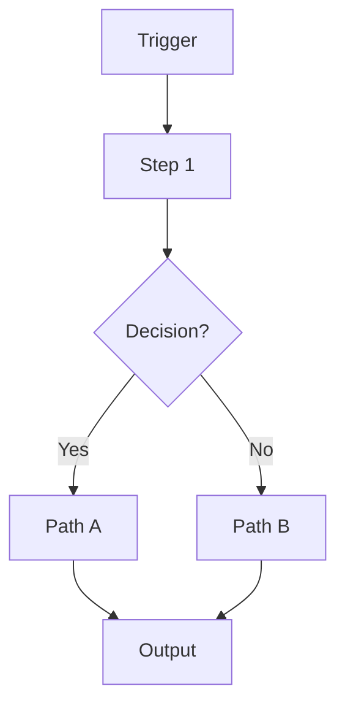

# [Project Name]

<!-- shields.io badges — replace slugs as needed -->


> **One-line tagline** — What does this automation do in plain English?

---

## Overview

2–3 sentences describing what this workflow does, why it was built, and what outcome it delivers. Write this so a non-technical business owner can immediately understand the value.

---

## Use Case

**Who uses this?**
[e.g. A small business owner who wants to automatically respond to Google Reviews without hiring a social media manager.]

**Problem it solves:**
[e.g. Manually responding to every Google review is time-consuming and inconsistent. Negative reviews that go unanswered damage reputation.]

**Result:**
[e.g. Every review gets a professional, AI-crafted response within minutes — personalized to whether it's positive or negative.]

---

## Architecture



> Replace this diagram with the actual workflow graph. Use `flowchart TD` for top-down flows, `flowchart LR` for left-right.

---

## Tech Stack

| Tool | Role |
|------|------|
| n8n | Workflow orchestration |
| OpenAI GPT-4o | AI text generation |
| Twilio | Messaging delivery |
| [Add more rows...] | |

---

## Setup Instructions

> **Prerequisites:** An active n8n instance (cloud or self-hosted), accounts for each service listed above.

1. **Clone this repository**
   ```bash
   git clone https://github.com/YOUR_USERNAME/automation-portfolio.git
   cd automation-portfolio/projects/XX-project-name
   ```

2. **Copy the environment variables file**
   ```bash
   cp .env.example .env
   ```

3. **Fill in your credentials** — open `.env` and replace each placeholder with your real values. See the [Environment Variables](#environment-variables) section below.

4. **Import the workflow** — open your n8n instance, go to **Workflows → Import**, and upload `workflow.json` from this folder.

5. **Configure credentials in n8n** — n8n will prompt you to connect each service. Use the values from your `.env` file.

6. **Activate the workflow** — toggle the workflow to **Active**. The webhook URL will be displayed in the trigger node.

7. **Test** — [Describe the quickest way to trigger a test run, e.g. send a WhatsApp message to your Twilio sandbox number.]

---

## Environment Variables

| Variable | Description | Where to find it |
|----------|-------------|-----------------|
| `EXAMPLE_API_KEY` | API key for Example Service | [Service dashboard → API Keys] |
| `EXAMPLE_WEBHOOK_URL` | Your n8n webhook endpoint | n8n → Webhook node → copy URL |

See `.env.example` for the full list with placeholder values.

---

## Key Design Decisions

> This section is for technical reviewers. Explain the *why* behind your choices.

**Why [Tool A] instead of [Tool B]?**
[e.g. We used n8n's built-in HTTP Request node instead of a custom Code node to keep the workflow maintainable by non-developers.]

**How is error handling implemented?**
[e.g. Each AI step has a fallback branch — if the LLM call fails, the workflow sends an alert to a Slack channel and logs the failed payload to a database for manual review.]

**How are credentials secured?**
[e.g. All API keys are stored as n8n credentials (encrypted at rest), never hardcoded in workflow nodes.]

**Scalability considerations:**
[e.g. The webhook uses n8n's queue mode to handle burst traffic without dropping messages.]

---

## License

MIT — see [LICENSE](../../LICENSE) for details.

---

*Built by [Evance Chapuma](https://www.upwork.com/freelancers/YOUR_PROFILE_ID) — AI Automation Specialist*
